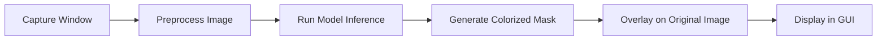

# AI_handson
Realtime prostate cancer segmentation demo

# Real-Time Segmentation Overlay System

This project captures a specific window on your screen, runs a PyTorch-based segmentation model on it, colorizes the segmentation output based on class labels, and overlays the results onto the live window view in real-time.

The GUI is built using **Tkinter**, and **PyTorch** is used for the deep learning inference.

---

## Features

- 🖼️ Real-time background screenshot capturing.
- 🧖️ On-the-fly deep learning inference (PyTorch 1.8.2).
- 🎨 Segmentation output colorized by class.
- 🪟 Windows-native GUI with Tkinter and Win32 API.
- 🔥 Fast inference with mixed precision (`torch.cuda.amp.autocast`).

---

## Requirements

Install dependencies using:

```bash
pip install -r requirements.txt
```

**Python Version:**  
- Python 3.8 or newer is recommended.

**Main libraries:**
- `torch==1.8.2`
- `torchvision==0.9.2`
- `Pillow`
- `pywin32`
- `tkinter` (comes with Python standard installation)

---

## Files

| File                        | Description                                             |
|------------------------------|---------------------------------------------------------|
| `main.py`                    | Main script to run the GUI and segmentation overlay.    |
| `CaptureWindow.py`           | Utility functions to capture Windows screen contents.   |
| `requirements.txt`           | Python dependency list.                                |
| `README.md`                  | This documentation file.                               |

---

## How to Run

1. Install Python 3.8+ and dependencies:

   ```bash
   pip install -r requirements.txt
   ```

2. Ensure your segmentation model is correctly loaded in `main.py`.

3. Launch the script:

   ```bash
   python main.py
   ```

4. A window will pop up showing the live screen with the segmentation overlay.

---

## Model Requirements

- The segmentation model must output a tensor of shape `[batch_size, 6, H, W]`, where 6 is the number of classes.
- If using a custom model, ensure that the output channels match the class indices (0–5).

---

## Class Color Map 🎨

| Class | Color | Preview |
|:-----:|:------|:--------|
| 0     | Black | ⚫ |
| 1     | White | ⚪ |
| 2     | Green | 🟢 |
| 3     | Blue  | 🔵 |
| 4     | Orange| 🔶 |
| 5     | Red   | 🔴 |

---

## Example (Before/After)

| Original Screenshot | Segmentation Overlay |
|:-------------------:|:--------------------:|
|  |  |

*(You can create these example images after running the system.)*

---

## System Pipeline



---

## License

This project is provided as-is for research and educational purposes.

---

## Notes

- Only Windows OS is supported (because of `win32gui` and DC capture).
- The segmentation overlay is blended with 50% transparency over the background.
- You can modify the color map inside the script if you want to assign different colors for different classes.

---

# 🎯 Quick Preview

> **Live capture → Deep learning → Colorize → Display** — everything happening seamlessly!

